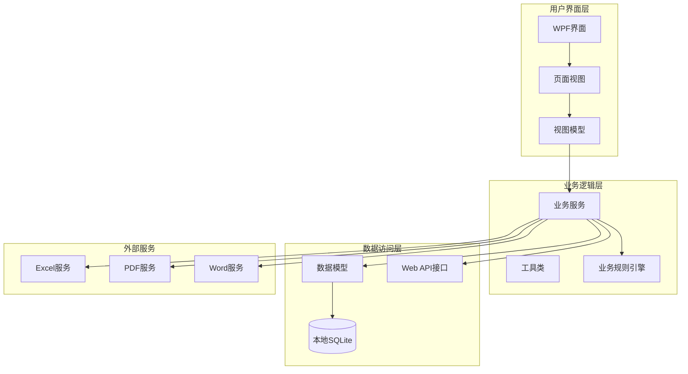
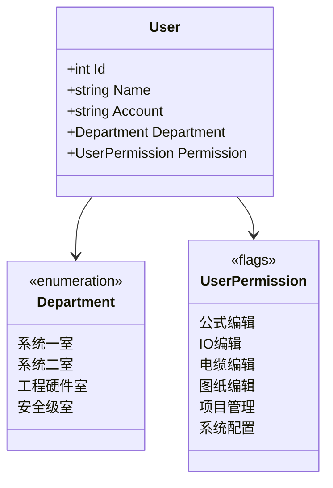
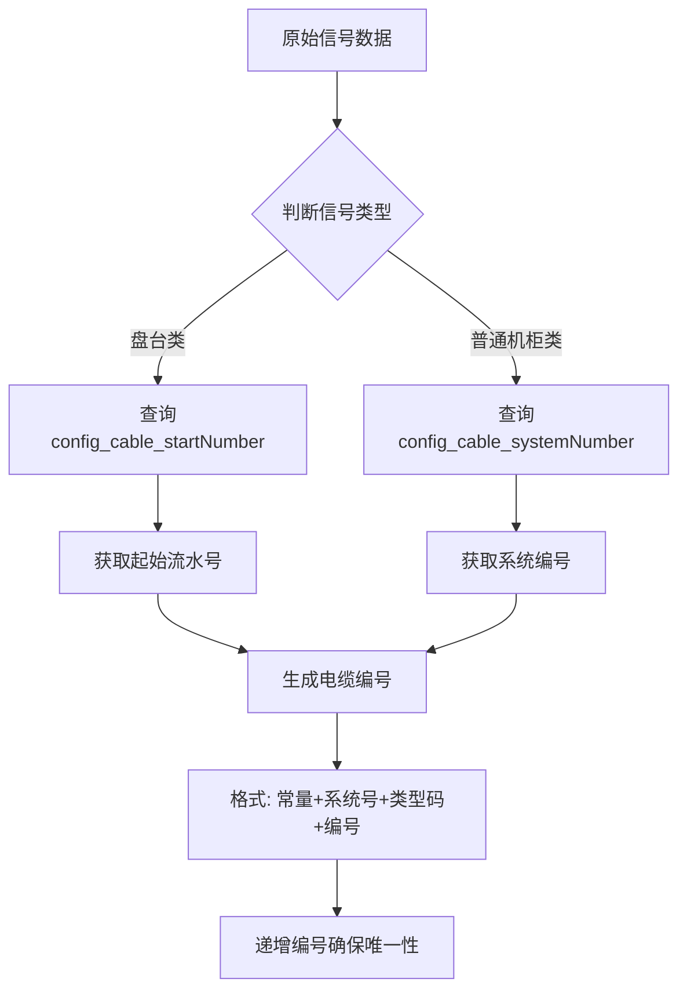
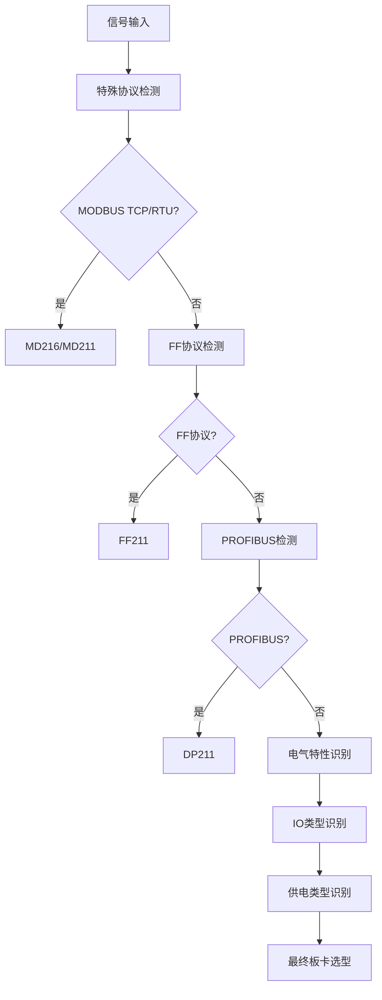
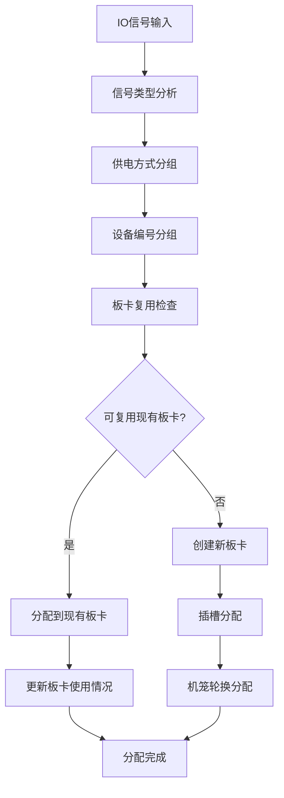
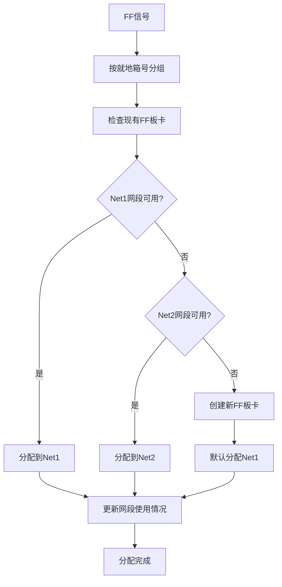
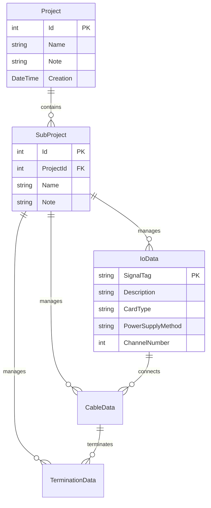

# IO管理平台用户手册与业务规则文档

## 概述

本文档为IO管理平台提供完整的用户操作指南和业务规则说明。IO管理平台是一个专为工业自动化领域设计的数据管理系统，主要用于管理IO点表、电缆配置、端接数据、项目配置等工程数据，支持多种文件格式的导入导出，具备数据对比分析、自动化配置生成等核心功能。

### 系统特点
- 分层架构设计，支持本地存储与Web API同步
- 基于MVVM模式的WPF界面，提供直观的用户体验
- 支持Excel、PDF、Word等多格式文件处理
- 集成复杂的工业自动化业务规则与计算逻辑
- 提供权限管理与部门级数据隔离

## 技术架构

### 整体架构图



### 核心组件
- **IODataPlatform**: 主应用程序，包含所有业务功能
- **IODataPlatform.WebApi**: Web API服务，支持文件服务和远程通信
- **LYSoft.Libs系列**: 独立类库，处理Excel、PDF、Word文档操作

## 用户手册

### 系统启动与登录

#### 首次启动
1. 运行IODataPlatform.exe启动应用
2. 系统将显示包含GIF动画的登录界面
3. 输入用户名和密码进行身份验证
4. 登录成功后系统将根据用户权限显示可访问的功能模块

#### 权限体系
系统基于部门和权限码的双重控制机制：



#### 主界面导航
登录后将显示主窗口，包含：
- **侧边栏菜单**: 根据用户权限动态显示功能模块
- **面包屑导航**: 显示当前页面路径
- **内容区域**: 显示具体功能页面
- **状态栏**: 显示操作状态和进度信息

### 项目管理

#### 创建项目
1. 在主菜单中选择"项目管理"
2. 点击"新建项目"按钮
3. 填写项目基本信息：
   - 项目名称（必填）
   - 项目描述
   - 创建时间（自动填充）
4. 点击"保存"完成项目创建

#### 项目配置
每个项目可包含多个子项目，支持层级管理：
- **主项目**: 顶层项目容器
- **子项目**: 具体的工程项目，可独立管理IO数据

### IO数据管理

#### 导入IO数据

**前置条件**：
- 已创建项目和子项目
- 具备IO编辑权限
- 准备符合格式要求的Excel文件

**操作步骤**：
1. 选择所属部门对应的IO数据页面（如"系统一室"、"系统二室"）
2. 点击"导入"按钮或使用快捷工具栏
3. 在文件选择对话框中选择Excel文件（支持.xls和.xlsx格式）
4. 系统将自动解析文件内容并进行数据校验
5. 校验通过后数据将写入数据库并更新界面显示

**数据校验规则**：
- 信号位号必须唯一
- 板卡类型不能为空
- 供电方式与板卡类型必须匹配
- 端子板型号必须与板卡类型兼容

#### 编辑IO数据
1. 在IO数据列表中双击需要编辑的行
2. 在弹出的编辑器中修改字段值
3. 系统将实时进行业务规则验证
4. 点击"保存"提交修改

#### 导出IO数据
支持多种导出模式：
- **导出全部**: 导出当前项目的所有IO数据
- **导出筛选**: 仅导出当前筛选结果
- **导出可发布**: 导出已审核的正式数据

### 电缆管理

#### 电缆数据导入
1. 在主菜单选择"电缆管理"
2. 点击"导入"功能
3. 选择电缆清单Excel文件
4. 系统将根据预定义规则自动生成电缆编号和配置信息

#### 电缆编号规则
系统根据起点终点信息自动生成电缆编号：



#### 电缆规格选择
系统根据信号连接点数自动选择合适的电缆规格：
- 查询`config_cable_spec`表获取可用规格
- 按连接点数从大到小排序
- 选择第一个满足要求的规格（贪心算法）

### 端接管理

#### 端接数据导入
1. 选择"端接管理"功能
2. 点击"导入端接表"
3. 选择端接Excel文件
4. 系统将解析端接关系并建立信号连接映射

#### 端接规则配置
端接规则存储在`config_termination_yjs`表中，支持：
- 典型回路库管理
- 端子号自动分配
- 冲突检测与解决

### 数据对比分析

#### 对比功能
系统提供强大的数据对比能力：
1. 选择"数据对比"功能
2. 选择要对比的两个数据源（可以是不同版本或不同项目）
3. 系统将自动分析差异并生成对比报告

#### 对比结果
对比结果包含：
- **新增记录**: 在新数据中存在但旧数据中不存在的记录
- **删除记录**: 在旧数据中存在但新数据中不存在的记录  
- **修改记录**: 主键相同但内容发生变化的记录

### 文件导出

#### 多格式导出支持
系统支持导出多种格式：

**Excel导出**：
- 标准数据表格
- 自定义模板
- 批量数据处理

**PDF导出**：
- 格式化报表
- 图纸文档
- 打印预览

**Word导出**：
- 技术文档
- 报告模板
- 自动化排版

#### 导出模板下载
每个功能模块都提供标准导入模板：
1. 在对应功能页面点击"下载模板"
2. 系统将生成包含示例数据的Excel模板
3. 模板将自动保存到桌面

## 业务规则详解

### 信号连接点计算规则

信号连接点计算是系统核心业务逻辑之一，根据端子板型号、通道号、信号有效方式等参数计算实际连接点位。

#### 正极连接点计算逻辑

```mermaid
flowchart TD
    A[输入参数] --> B{端子板型号}
    B -->|TB221/TB222/TB242/TB243/TB246| C[通道+A]
    B -->|TB231/TB232/TB233| D{信号有效方式}
    D -->|空或NO| E[通道+B]
    D -->|NC| F[通道+A]
    B -->|TB241| G{板卡类型}
    G -->|AI212/AI216| H[通道+CHOOSE选择]
    B -->|TB244| I{板卡类型}
    I -->|AO215| J[通道×2+22]
    I -->|PI211| K[(通道-1)×4+2]
    I -->|MD211| L[CHOOSE固定值]
    B -->|TB271| M[固定连接点a]
    B -->|TB272| N[不需要连接--]
    B -->|TB251| O[通道+B]
    B -->|--| P[无端子板--]
    B -->|其他| Q[错误Err]
```

#### 计算规则表

| 端子板型号 | 板卡类型 | 信号方式 | 计算公式 | 示例 |
|------------|----------|----------|----------|------|
| TB221/TB222/TB242/TB243/TB246 | 通用 | 通用 | 通道+"A" | 1A, 2A |
| TB231/TB232/TB233 | DO | 空/NO | 通道+"B" | 1B, 2B |
| TB231/TB232/TB233 | DO | NC | 通道+"A" | 1A, 2A |
| TB241 | AI212/AI216 | 通用 | 通道+CHOOSE(供电方式[3]) | 1B, 2A |
| TB244 | AO215 | 通用 | 通道×2+22 | 24, 26 |
| TB244 | PI211 | 通用 | (通道-1)×4+2 | 2, 6 |
| TB244 | MD211 | 通用 | CHOOSE(通道,1→"8",2→"28") | 8, 28 |
| TB271 | FF | 通用 | "a" | a |
| TB272 | DP | 通用 | "--" | -- |
| TB251 | AO | 通用 | 通道+"B" | 1B, 2B |

### 供电方式识别规则

供电方式识别基于信号描述和供电类型字段：

#### 识别流程

```mermaid
flowchart TD
    A[输入描述和供电类型] --> B{包含TCP/RTU协议?}
    B -->|是| C[返回--]
    B -->|否| D{供电类型前缀}
    D -->|AI| E[AI供电方式计算]
    D -->|AO| F[返回DCS]
    D -->|P| G[P供电方式计算]
    D -->|DI| H[DI供电方式计算]
    D -->|DO| I[DO供电方式计算]
    D -->|FF| J[FF供电方式计算]
    D -->|DP| K[返回DCS(220VAC)]
    D -->|其他| L{检查协议关键字}
    L -->|包含DP| M[返回--]
    L -->|包含OPC| N[返回--]
    L -->|其他| O[返回Err]
```

#### 供电方式映射表

| 供电类型 | 编号 | 供电方式 |
|----------|------|----------|
| AI1 | 1 | DCS |
| AI2 | 2 | DCS(提供24VDC) |
| AI3 | 3 | DCS(提供220VAC) |
| AI4 | 4 | USER |
| AI5 | 5 | USER |
| AI6 | 6 | DCS(提供220VAC) |
| AI7 | 7 | DCS |
| AI8 | 8 | DCS |
| AI9 | 9 | DCS |
| AI10 | 10 | DCS |

### 板卡类型识别规则

板卡类型识别采用多级判断策略：

#### 识别优先级



#### 板卡选型规则表

| 信号类型 | 电气特性 | 协议 | 板卡型号 | 说明 |
|----------|----------|------|----------|------|
| AI | 4-20mA | 硬接线 | AI216 | 标准电流信号 |
| AI | TC | 硬接线 | AI221 | 热电偶信号 |
| AI | PT100 | 硬接线 | AI232 | 热电阻信号 |
| DI | - | 硬接线 | DI211 | 数字输入 |
| AO | - | 硬接线 | AO215/AO211 | 模拟输出 |
| DO | - | 硬接线 | DO211 | 数字输出 |
| PI | - | 硬接线 | PI211 | 脉冲输入 |
| - | - | MODBUS TCP | MD216 | 以太网通信 |
| - | - | MODBUS RTU | MD211 | 串口通信 |
| - | - | FF | FF211 | 现场总线 |
| - | - | PROFIBUS | DP211 | 现场总线 |

### 端子板选型规则

端子板选型基于板卡类型和供电方式：

#### 选型映射表

| 板卡类型 | 供电方式/信号类型 | 端子板型号 | 说明 |
|----------|-------------------|------------|------|
| DO211 | USER供电 | TB231 | 用户供电继电器输出 |
| DO211 | DCS供电 | TB233 | DCS供电继电器输出 |
| DI211 | DCS供电 | TB222 | DCS供电数字输入 |
| DI211 | USER供电 | TB221 | 用户供电数字输入 |
| FF211 | DCS供电 | TB271 | 现场总线端子板 |
| DP211 | - | TB272 | PROFIBUS端子板 |
| AI216 | 4-20mA | TB241 | 模拟量输入 |
| AI232 | PT100 | TB246 | 热电阻输入 |
| AO211 | - | TB251 | 模拟量输出 |
| PI211/AO215 | - | TB244 | 多功能端子板 |
| AI212 | 热电偶 | TB241 | 模拟量输入 |
| AI221 | 热电偶 | TB242 | 热电偶输入 |
| MD211 | 串口 | TB244 | 通信端子板 |
| MD216 | 以太网 | -- | 不需要端子板 |

### IO分配规则

IO分配是系统最复杂的业务规则之一，采用分层分组策略：

#### 分配策略概述



#### 分配优先级

**IO类型优先级**：
1. AI（模拟量输入）- 优先级1
2. PI（脉冲输入）- 优先级2  
3. AO（模拟量输出）- 优先级3
4. DI（数字量输入）- 优先级4
5. DO（数字量输出）- 优先级5

**信号类型优先级**：
1. 反馈信号（包含KW、GW、QF、TF、GZ关键字）
2. 普通信号（按设备前缀分组）
3. 报警信号（最后分配）

#### 供电方式分组规则

| 分组编号 | 供电类型 | 说明 |
|----------|----------|------|
| Group1 | DI1, DI6 | DI信号分组1 |
| Group2 | DI2, DI3, DI4, DI5 | DI信号分组2 |
| Group3 | DO1, DO2 | DO信号分组1 |
| Group4 | DO3 | DO信号分组2 |
| Group5 | DO4 | DO信号分组3 |
| Group6 | DO5 | DO信号分组4 |
| Group7 | AI1, AI6 | AI信号分组1 |
| Group8 | AI2, AI3, AI4, AI5 | AI信号分组2 |
| Group9 | AI7, AI8, AI9 | AI信号分组3 |
| Group10 | P1, P2, P3 | 脉冲信号分组 |
| Group11 | AO1 | AO信号分组1 |
| Group12 | AOH | AO信号分组2 |
| Group13 | AO2 | AO信号分组3 |

#### FF总线信号分配

FF信号具有特殊的分配规则：



**网段分配策略**：
- 一个FF箱子的所有信号分配到同一网段
- 优先分配到Net1网段（前半部分通道）
- Net1满载时分配到Net2网段（后半部分通道）
- 支持FF总线模块和FF从站模块板卡复用

#### 冗余率控制

系统通过冗余率控制确保板卡可靠性：

**计算公式**：
```
可用通道数 = 总通道数 - ⌈总通道数 × 冗余率⌉ - 已占用通道数
```

**应用场景**：
- 新建板卡：不考虑冗余率限制
- 复用板卡：严格按冗余率计算可用通道
- FF网段分配：分别计算Net1和Net2的冗余率

### 编号生成规则

#### IO点名生成规则

**格式**: `R{变量名}[_{扩展码}]`

- 前缀：固定添加"R"标识符  
- 变量名处理：去除空格和连字符
- 扩展码：非空时添加下划线分隔符

**示例**：
- R010001_PV（带扩展码）
- R010002（无扩展码）

#### 板卡柜内编号生成规则

**格式**: `{笼号}{槽位:00}{类型标识}`

- 笼号：直接使用原值
- 槽位：格式化为两位数字（如01、02、10）  
- 类型标识：AI232/AI221使用"TC"，其他类型取前两位字符

**示例**：
- 101AI（笼1槽01的AI板卡）
- 205TC（笼2槽05的热电偶板卡）

#### 端子板编号生成规则

- 不需要端子板：返回"--"
- FF211板卡：`{笼号}{槽位:00}_{网络号}FI`（网络号：Net1=1，Net2=2）
- 其他板卡：`{笼号}{槽位:00}BN`

**示例**：
- 101_1FI（FF板卡Net1）
- 205BN（普通板卡）

#### 板卡系统地址计算

**公式**: `(笼号-1) × 10 + 槽位号`

**示例**：
- 笼1槽1 → 地址1
- 笼1槽10 → 地址10  
- 笼2槽1 → 地址11
- 笼3槽5 → 地址25

### 数据校验规则

#### 必填字段校验
- 信号位号必须唯一且不为空
- 板卡类型必须在预定义列表中
- 端子板型号必须与板卡类型兼容
- 供电方式不能为空

#### 业务逻辑校验
- 供电方式与板卡类型必须匹配
- 端子板型号与板卡类型必须兼容
- 通道号必须在板卡支持的范围内
- FF信号的网段分配必须合理

#### 关联性校验
- 项目与子项目的关联完整性
- 电缆两端信号的存在性验证
- 端接关系的双向一致性检查

### 导出格式规则

#### 输出精度控制

根据测量范围自动调整显示精度：

| 测量范围 | 显示精度 | 说明 |
|----------|----------|------|
| ≤ 10 | 3位小数 | 高精度测量 |
| ≤ 100 | 2位小数 | 中精度测量 |
| ≤ 100000 | 1位小数 | 低精度测量 |
| > 1000000 或 < 0.0001 | 科学计数法 | 极值处理 |
| 其他 | 整数显示 | 标准显示 |

#### 站号分配规则
- 起始地址：2（保留地址0和1为系统使用）
- 分配方式：按机柜编号顺序递增
- 地址范围：2-125（PROFIBUS协议限制）

## 故障排除指南

### 常见问题及解决方案

#### 数据导入问题

**问题**：Excel导入失败，提示格式错误
**解决方案**：
1. 检查Excel文件格式是否为.xls或.xlsx
2. 确认首行为字段标题
3. 验证必填字段是否完整
4. 使用系统提供的模板重新填写数据

**问题**：导入数据后部分字段显示错误
**解决方案**：
1. 检查字段映射是否正确
2. 验证数据类型是否匹配
3. 确认特殊字符是否正确转义

#### IO分配问题

**问题**：系统提示"没有找到盘台匹配的流水号"
**解决方案**：
1. 检查`config_cable_startNumber`表中是否存在匹配记录
2. 验证起点盘柜号和序列是否正确
3. 确认配置表数据完整性

**问题**：分配失败，提示"超过最大流水号"
**解决方案**：
1. 检查`config_cable_systemNumber`表中的`MaxNo`值
2. 考虑增加最大编号限制
3. 重置`MinNo`到合理范围

#### 板卡分配问题

**问题**：FF信号无法分配到合适网段
**解决方案**：
1. 检查FF板卡的网段使用情况
2. 验证同一箱号信号是否超出网段容量
3. 考虑增加新的FF板卡

**问题**：冗余率计算异常
**解决方案**：
1. 检查板卡配置表中的通道数配置
2. 验证冗余率设置是否合理（建议10-20%）
3. 重新计算板卡利用率

### 性能优化建议

#### 大数据量处理
- 对于超过10000条记录的数据，建议分批处理
- 使用数据库索引优化查询性能
- 考虑异步处理避免界面卡顿

#### 配置表优化
- 对常用查询字段建立索引
- 定期清理无效的配置数据
- 缓存频繁访问的配置信息

## 附录

### 系统配置参数

#### 数据库配置
- **连接字符串**: 本地SQLite数据库
- **备份策略**: 每日自动备份到指定目录
- **同步机制**: 支持与Web API的增量同步

#### Web API配置
- **基础地址**: 在appsettings.json中配置
- **超时设置**: 默认30秒
- **重试策略**: 自动重试3次

#### 文件路径配置
- **本地存储**: %LocalAppData%\IODataPlatform\Storage
- **模板目录**: 应用程序根目录\Templates
- **导出目录**: 用户桌面（可自定义）

### 数据模型参考

#### 核心实体关系



### 更新日志

#### 版本历史
- **v1.0.0**: 初始版本，基础IO管理功能
- **v1.1.0**: 增加电缆管理和端接功能
- **v1.2.0**: 完善业务规则和自动化分配
- **v1.3.0**: 增强数据校验和导出功能

#### 已知限制
- 单次导入数据量建议不超过50000条
- FF板卡最多支持16个网段
- 虚拟插槽数量限制为100个

### 联系方式

如需技术支持或报告问题，请联系开发团队：
- 技术支持邮箱：support@example.com
- 问题反馈：通过系统内置反馈功能
- 文档更新：定期检查系统公告